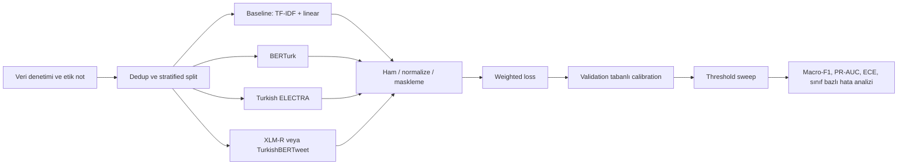

# P7 Türkçe Toksik Dil Tespiti Projesi İçin Gerçekçi Değerlendirme

## Yönetici özeti

Evet, bu konu mantıklı. Hatta dersin tarif ettiği “deney ağırlıklı” proje formatına en doğal oturan seçeneklerden biri. Çünkü yalnızca bir model eğitip skor vermekle bitmiyor; veri dengesizliği, çok sınıflı etiketleme, ön işleme, model karşılaştırması, kalibrasyon ve karar eşiği seçimi gibi birbirinden ayrı ama birbirini besleyen deney eksenleri sunuyor. Seçtiğin veri kümesi de bu açıdan zengin: veri kartı 77.800 örnek, beş ince sınıf ve pseudo-label ile genişletilmiş birleşik bir yapı bildiriyor. Bu, iyi bir ders projesi için bol malzeme demek. citeturn9view0turn21view0turn19view0

Ama burada kritik gerçek şu: bu veri kümesi temiz bir benchmark değil. Veri kartı aynı anda hem ikili “offensive / not offensive” dilini kullanıyor, hem de `OTHER / PROFANITY / INSULT / RACIST / SEXIST` şeklinde beş sınıflı dağılım veriyor; ayrıca farklı kaynaklardan birleştirilmiş olduğunu ve pseudo-label kullandığını açıkça söylüyor. Yani bu projeyi güçlü yapacak şey “en yüksek F1” değil, bu veri kirliliğini dürüstçe teşhis edip buna rağmen sağlam bir deney tasarımı kurman olacaktır. Başka deyişle: proje iyi, veri kümesi kirli; senin işin bu kiri görmezden gelmek değil, araştırma sorusuna dönüştürmek. citeturn9view0turn10view0turn10view2turn19view1

## Net hüküm

Bu projeyi yapmanı savunurum; ama ancak konu başlığını doğru kurarsan. “Türkçe toksik dil tespiti” diye genel geçer bir başlık zayıf kalır. “Dengesiz ve birleştirilmiş Türkçe toksisite verisinde model kalibrasyonu ve karar eşiği seçimi” dersen, elindeki veri kümesinin kusuru senin deneysel katkın hâline gelir. Bu, hem moderasyon otomasyonu açısından anlamlıdır hem de mevcut Türkçe nefret söylemi / saldırgan dil literatüründeki sınırlı veri ve genellenebilirlik sorunlarıyla doğrudan konuşur. citeturn21view0turn26view0turn15view2

Ama scope’u kontrol etmezsen batarsın. Çok sınıf, üç transformer, TF‑IDF baseline, normalization, küfür maskleme, class-balanced loss, calibration, threshold sweep, hata analizi, explainability, hem binary hem multiclass değerlendirme… bunların hepsini tam genişlikte yapmaya kalkarsan 4–6 haftada dağınık bir “çok şey denedik” projesine dönüşür. Sonuçta profesörün aklında kalan şey derinlik değil, karmaşa olur. Son derece net söyleyeyim: bu proje iyi bir seçim, ama yalnızca bir ana araştırma sorusuna kilitlenirsen. citeturn9view0turn7view0turn26view0

## Veri kümesi denetimi

Başlangıç noktası olarak urlOverfit-GM/turkish-toxic-language veri kartınıturn0search0 metodoloji belgesi gibi okumalısın. Kart Apache-2.0 lisansı bildiriyor; toplam 77.800 örnek olduğunu, sınıf dağılımının `OTHER 37.663`, `PROFANITY 18.252`, `INSULT 10.777`, `RACIST 10.163`, `SEXIST 945` olduğunu, ayrıca verinin çeşitli mevcut veri kümelerinden birleştirildiğini ve pseudo-label ile genişletildiğini söylüyor. Bu tek başına iki şeyi anlatıyor: veri setin sunum için yeterince büyük ve ilginç; ama özellikle `SEXIST` sınıfı aşırı küçük olduğu için accuracy ya da micro-F1 ile kendini kandırman da çok kolay. citeturn9view0

Daha önemlisi, bu beş sınıflı etiket uzayı kaynak veri kümelerinin orijinal dünyasına bire bir karşılık gelmiyor. Kartın referans verdiği kaynaklardan biri olan urloffenseval2020_tr veri kartıturn5search3 saf ikili `OFF / NOT` sınıflandırma anlatıyor; urlTürkçe Nefret Söylemi Veri Seti 2 depo sayfasıturn5search2 ise `nefret / saldırgan / hiçbiri` şeklinde üç sınıf veriyor. Bu yüzden son veri kümesindeki çok sınıflı etiketleme, en azından kısmen, kaynaklar arası etiket eşleme ve pseudo-label kararlarının sonucu. Bu da şu anlama gelir: senin çok sınıflı problem ayarın “tamamı elle ve tek şema ile etiketlenmiş altın standart” değil; “türetilmiş çok sınıflı görev.” Bunu sunumda söylemezsen zayıf yakalanırsın. Söylersen güçlenirsin. citeturn9view0turn10view0turn10view2

Veri önizleme satırları da ince sınıf etiketine ek olarak kaynak-benzeri bir alan ve 0/1 bayrak bulunduğunu düşündürüyor; veri kartında ise resmi train/validation/test protokolü dokümante edilmiyor. Bu yüzden benim sert önerim şu: projeyi baştan hiyerarşik tasarla. Birincil akademik görev olarak beş sınıflı tek-etiket sınıflandırma yap; ama operasyonel görev olarak ayrıca “toksik / değil” karar sürecini ayrı incele. Böylece veri kümesindeki ikili ve çok sınıflı gerilim senin zayıf noktan değil, deney tasarımının parçası olur. citeturn1view0turn9view0

## Önceki çalışmalar

Türkçe entity["academic_field","Doğal dil işleme","NLP"] literatüründe saldırgan dil ve nefret söylemi tarafı uzun süre veri kıtlığı çekti. 2023 tarihli kapsamlı bir Türkçe NLP kaynak taraması, offensive language alanında kamuya açık kaynakların az olduğunu; kamuya açık büyük örnekler olarak Çöltekin’in offensive corpus’unu ve daha sonra gelen iki nefret söylemi veri setini öne çıkarıyor. Bu, senin sorun alanının “aşırı çalışılmış bir ders projesi klişesi” değil, hâlâ kurumsallaşmakta olan bir Türkçe alt-alan olduğunu gösteriyor. citeturn21view0turn21view1

En temel başlangıç taşı urlA Corpus of Turkish Offensive Language on Social Mediaturn5search0. Bu çalışma, 36.232 tweet ile ilk açık büyük Türkçe offensive corpus’u tanıtıyor; yaklaşık yüzde 19’unun offensive içerik taşıdığını ve sınıflandırıcıların offensive tweet tespitinde yüzde 77,3 F1, hedefli / hedefsiz ayrımında yüzde 77,9 F1, hedef alt sınıflarında ise yüzde 53,0 F1 elde ettiğini raporluyor. Bu son rakam özellikle önemli: Türkçede ince ayrımlı toksisite sınıflarına geçince işin zorlaştığı yeni bir şey değil; literatürde zaten görülen yapısal sorun. citeturn10view1

Bunu izleyen entity["event","OffensEval 2020","multilingual offensive language shared task"] Türkçe sistem makalesi, entity["software","BERTurk","Turkish pretrained transformer language model"]’ün CNN‑LSTM ve BiLSTM‑Attention gibi modelleri geçtiğini, validation’da 0,814 macro-F1 gördüğünü; ama esas kazancın BERTurk ağırlıklı bir ensemble ile geldiğini ve bu yaklaşımın Türkçe alt-görevde ikinci sıraya yerleştiğini gösteriyor. Aynı çalışma, tweet üzerinde eğitilmiş kelime vektörlerinin faydalı olduğunu ama bağlam modellemesinin daha da önemli kaldığını söylüyor. Senin için çıkarım açık: yalnızca bir transformer fine-tune etmek yetmez; veri dengesizliği, threshold ve gerekirse hafif ensemble / calibration düşünmek akademik olarak meşru. citeturn24view0turn24view1turn24view2turn24view3

Türkçe nefret söylemi tarafında iki çalışma özellikle kritik. urlA Turkish Hate Speech Dataset and Detection Systemturn11search1, iki farklı domain’de toplanmış veriyle entity["software","BERTurk","Turkish pretrained transformer language model"] baseline’ı kuruyor ve binary doğruluğu İstanbul Sözleşmesi veri setinde yüzde 77, mülteci veri setinde yüzde 71 olarak raporluyor; yani domain kayması gerçek ve pahalı. urlLarge-Scale Hate Speech Detection with Cross-Domain Transferturn12search0 ise Türkçe için 100 bin tweetlik büyük veri kurup transformer modellerin klasik bag-of-words ve daha eski neural yaklaşımları en az yüzde 10 geçtiğini, üstelik verinin yalnızca yüzde 20’siyle tam performansın yüzde 97’sinin geri kazanılabildiğini gösteriyor. Bu da sana şunu söyler: büyük veri her şeyi çözmüyor; asıl mesele değerlendirme protokolü ve domain genellenebilirliği. citeturn15view3turn15view2

Daha güncel tarafta entity["event","HSD-2Lang 2024","Turkish and Arabic hate speech detection shared task"] çok öğretici. Shared task overview makalesi, Türkçe alt görevde katılan takımların tamamının BERT-tabanlı sistemlerle çalıştığını; en yüksek sonucun ConvBERTurk ensemble’dan geldiğini, ikinci ve üçüncü sıraların ise tweet-özgül entity["software","TurkishBERTweet","Turkish social media language model"] ile alındığını anlatıyor. Aynı makale, aynı model ailesini kullanan takımlar arasında hiperparametre farklarının ciddi skor farkı yarattığını vurguluyor. Yani burada “hangi model?” kadar “nasıl fine-tune ettin, nasıl temizledin, nasıl eşikledin?” sorusu önemli. citeturn26view0

Ayrıca 2025’te yayımlanan bir Türkçe çok sınıflı siber zorbalık çalışması, `neutral / offensive / sexism / racism` düzeninde küçük ama ilgili bir veri setinde BERTurk, ConvBERTurk ve DistilBERTurk’ü karşılaştırıp en yüksek toplam F1’i BERTurk ile 0,884 olarak raporluyor; offensive ve neutral ayrımının daha zor olduğunu, PR eğrilerini sınıf dengesizliği için ayrıca incelediğini ve veri taraflılığının yorumlamayı zorlaştırdığını açıkça yazıyor. Bu çalışma senin proje fikrine neredeyse doğrudan destek veriyor: çok sınıf + dengesizlik + sınıf bazlı hata analizi hattı gerçek bir araştırma çizgisi. citeturn7view0

## Bu veri kümesiyle ilgili mevcut izler

Burada acımasız gerçek şu: taradığım kaynaklarda bu exact veri kümesi adıyla ilişkilendirilmiş güçlü bir ACL / IEEE / major-konferans makalesi görünmüyor. Görünen izler daha çok topluluk veri kartı, bu veri üzerinde fine-tune edilmiş kamuya açık model kartları ve organizasyon düzeyinde proje anlatıları. Veri sayfası, bu veri üzerinde eğitilmiş birkaç kamuya açık modeli listeliyor; organizasyon sayfası ise offensive language tespiti için “NoOffense” aracı geliştirdiklerini ve offensive-language odaklı çok sayıda model yayınladıklarını söylüyor. Bu, veri kümesinin “tamamen sahipsiz” olmadığını ama akademik benchmark olarak da oturmuş olmadığını gösteriyor. citeturn17search0turn22view0

Bu veri kümesiyle bağlantılı gördüğüm kamuya açık modellerden biri olan urlfc63/toxic-category-model kartıturn17search5, veri kümesini kullandığını ve beş sınıfı sıraladığını söylüyor; fakat değerlendirme kısmında ayrıntılı makro/metrik dökümü, split protokolü ya da tekrarlanabilir deney şeması vermiyor. Kısacası bu veri kümesinde “liderlik tablosu” gibi güvenilir bir geçmiş yok. Bu senin için kötü değil; tersine fırsat. Çünkü özgün katkın veri kümesi icat etmek olmayacak, bu veri kümesine düzgün protokol, calibration ve hata analizi getirmek olacak. citeturn23view0turn9view0

## Önerilen deney tasarımı

Ben olsam bu projeyi şu araştırma sorusuyla çivilerim: **“Birleştirilmiş ve dengesiz Türkçe toksisite verisinde Türkçe-özgül ön-eğitim ve post-hoc kalibrasyon, yalnızca macro-F1’i değil moderasyon kararlarının güvenilirliğini de artırıyor mu?”** Bu soru, hem entity["software","BERTurk","Turkish pretrained transformer language model"] ve Türkçe entity["software","ELECTRA","replaced-token pretraining transformer model"] gibi dil-özgül yaklaşımları, hem de entity["software","XLM-RoBERTa","multilingual transformer language model"] gibi çokdilli kontrol modelini meşrulaştırır. Ama stratejik not: ana hedefin Türkçe sosyal medya performansıysa, güncel Türkçe shared-task ve TurkishBERTweet sonuçları nedeniyle XLM‑R’ı “ana favori” değil “çokdilli kontrol” olarak konumlandırmak daha dürüst olur. Skor peşindeysen opsiyonel dördüncü model olarak entity["software","TurkishBERTweet","Turkish social media language model"] ya da ConvBERTurk eklemek, akademik açıdan da pratik açıdan da daha mantıklı. citeturn31search3turn31search0turn27view0turn26view0turn25view1turn25view3

**Birincil görev.** Beş sınıflı tek-etiket sınıflandırma.  
**İkincil operasyonel görev.** `toxic / other` ikili karar katmanı ve threshold sweep.  
**Gerçek baseline.** TF‑IDF + linear SVM ya da lojistik regresyon.  
**Derin modeller.** BERTurk, Türkçe ELECTRA, XLM‑R; süre kalırsa TurkishBERTweet ya da ConvBERTurk. Bu kurgu, hem eski Türkçe offensive literature’daki klasik taban çizgiyi hem de güncel BERT-tabanlı shared-task pratiğini kapsar. citeturn10view1turn24view3turn26view0

**Önişleme.** Ağır stemming/lemmatization yapma; transformer’ları gereksiz yere budarsın. Onun yerine üç kontrollü varyant kur: ham metin, hafif normalization, küfür maskleme. Kullanıcı adı / URL / emoji / hashtag dönüşümünü sabit kuralla ele al. Türkçe sosyal medya normalization literatürü, non-canonical metnin önemli bir ön işleme sorunu olduğunu; güncel hate-speech shared-task sistemleri ise emoji ve platform-özel token temizliğinin pratikte fark yarattığını gösteriyor. Buradaki kilit nokta şu: normalization’ı “doğru” diye değil, deneysel faktör diye ele al. citeturn32view0turn32view1turn26view0

**Dengesizlik yönetimi.** Önce class-weighted cross-entropy ile başla; focal loss ya da class-balanced loss’u ancak ikinci turda ekle. `SEXIST` sınıfı yalnızca 945 örnek olduğu için weighted loss’suz çok sınıflı sonuçlar vitrinlik olabilir ama içerik olarak boş çıkabilir. Ek olarak exact duplicate ve near-duplicate kontrolü yap; birleşik veri kümelerinde sızıntı riski gerçektir. citeturn9view0

**Kalibrasyon ve eşik seçimi.** Burada senin blog yazının omurgası var. Sırf argmax raporlamak yerine validation set üzerinde temperature scaling uygula. Bunu ana kalibrasyon baseline’ı yap; çünkü modern ağlarda şaşırtıcı derecede etkili ve ucuz bir post-hoc yöntem olarak kabul görüyor. Fakat çok sınıflı düzlemde yalnızca top-label confidence’a bakmanın yetmediğini, classwise-ECE gibi ölçütlerin önemli olduğunu da özellikle not et; Dirichlet calibration bu yüzden iyi bir “stretch goal” olur. Türkçe çok sınıflı siber zorbalık çalışmasının PR eğrilerini özellikle kullanması da bu hattın yerinde olduğunu gösteriyor. citeturn19view0turn19view1turn7view0

**Metrikler.** Ana metrik kesinlikle macro-F1 olmalı. Yanına sınıf bazlı F1, macro-PR-AUC, confusion matrix, gerekirse top-label ECE ve mümkünse classwise-ECE ekle. Eğer moderasyon senaryosu anlatacaksan, tek bir “en iyi threshold” yerine iki politika göster: biri macro-F1 optimize eden, diğeri recall-odaklı düşük eşik politikası. O zaman proje yalnızca model karşılaştırması değil, karar politikası karşılaştırması olur. citeturn24view3turn19view1turn7view0

Aşağıdaki akış, bu proje için gereksiz şişkinlik olmadan yeterince kuvvetli bir deney planıdır. Kaynak heterojenliği, normalization, model karşılaştırması ve calibration eksenlerini aynı omurgada tutar. citeturn9view0turn26view0turn19view0

## Teslim stratejisi

Bu konu 5–7 dakikalık sunuma rahat sığar; ama ancak hikâyeyi tek cümleye indirirsen. O cümle şudur: **“Türkçe toksik dil tespitinde en yüksek ham skor tek başına yeterli değildir; veri dengesizliği altında kalibrasyon ve eşik seçimi moderasyon davranışını ciddi biçimde değiştirir.”** Eğer bu cümleyi korursan sunumun dağılmaz. Eğer “biraz veri, biraz model, biraz etik, biraz explainability” diye her şeyi açarsan dağılır.

Git tarafında depo iskeleti doğrudan deney mantığını yansıtmalı: `data_audit`, `baseline_linear`, `train_transformers`, `calibration`, `threshold_sweep`, `error_analysis`, `results`. Blog yazısının odağı “aynı macro-F1, farklı moderasyon davranışı” olursa sıradan olmaz; calibration ve threshold seçimi gerçekten blog’a değer katar. IMRAD slaytlarında ise girişte problem önemi ve Türkçe literatür boşluğu, yöntemde veri denetimi + model seti, sonuçlarda sınıf bazlı F1 / PR / calibration, tartışmada ise hangi hata tiplerinin çözülemediği ve neden çözülemediği yer almalı.

Ben olsam proje başlığını da şöyle keskinleştirirdim: **“Birleştirilmiş ve Dengesiz Türkçe Toksisite Verisinde BERTurk, ELECTRA ve XLM‑R Karşılaştırması: Kalibrasyon, Eşik Seçimi ve Sınıf Bazlı Hata Analizi.”** Bu başlık akademik, deneysel ve savunulabilir. “Türkçe toksik dil tespiti” gibi yumuşak bir başlık ise fazla genel kalır.

## Temel kaynaklar

- urlOverfit-GM/turkish-toxic-language veri kartıturn0search0 — lisans, örnek sayısı, sınıf dağılımı, kaynak veri kümeleri ve pseudo-label notu burada. citeturn9view0
- urlA Corpus of Turkish Offensive Language on Social Mediaturn5search0 — ilk açık büyük Türkçe offensive corpus; ince sınıflarda zorluğu görmek için temel referans. citeturn10view1
- urlOffensEval 2020 Türkçe sistem makalesiturn11search0 — BERTurk, downsampling ve ensemble mantığını görmek için en faydalı kısa kaynak. citeturn24view0turn24view1turn24view2
- urlA Turkish Hate Speech Dataset and Detection Systemturn11search1 — Türkçe domain-spesifik hate speech veri seti ve BERTurk baseline. citeturn15view3
- urlLarge-Scale Hate Speech Detection with Cross-Domain Transferturn12search0 — domain transfer ve veri ölçeği hakkında çok güçlü Türkçe kanıt. citeturn15view2
- urlHSD-2Lang 2024 overview makalesiturn18search11 — güncel shared-task, güçlü modeller ve hiperparametre hassasiyeti. citeturn26view0
- urlTurkishBERTweet modeli ve makalesiturn18search10 — sosyal medya-özgül Türkçe model; genellenebilirlik ve hız argümanı için çok güçlü. citeturn25view0turn25view1turn25view3
- urlOn Calibration of Modern Neural Networksturn4search1 — temperature scaling’in neden ana baseline olması gerektiğini anlatan temel makale. citeturn19view0
- urlDirichlet calibration makalesiturn3search13 — çok sınıflı calibration tarafını ciddiye almak istersen gerekli genişletme. citeturn19view1
- urlNormalizing Non-canonical Turkish Texts Using Machine Translation Approachesturn29search0 ve urlSocial media text normalization for Turkishturn29search5 — normalization deneyini savunmak için yeterli Türkçe arka planı verir. citeturn32view0turn32view1