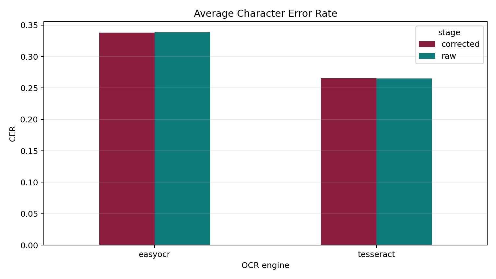
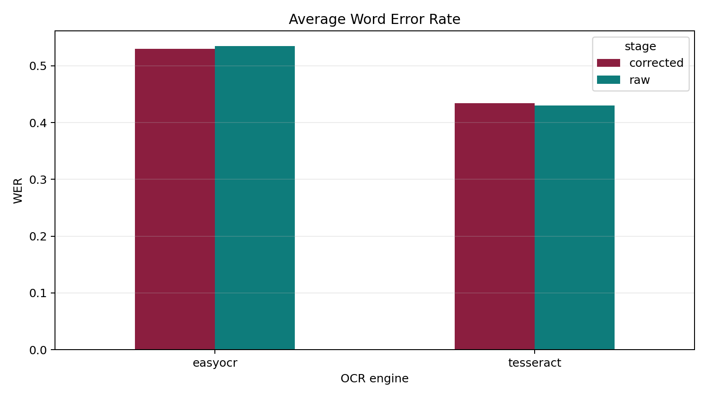
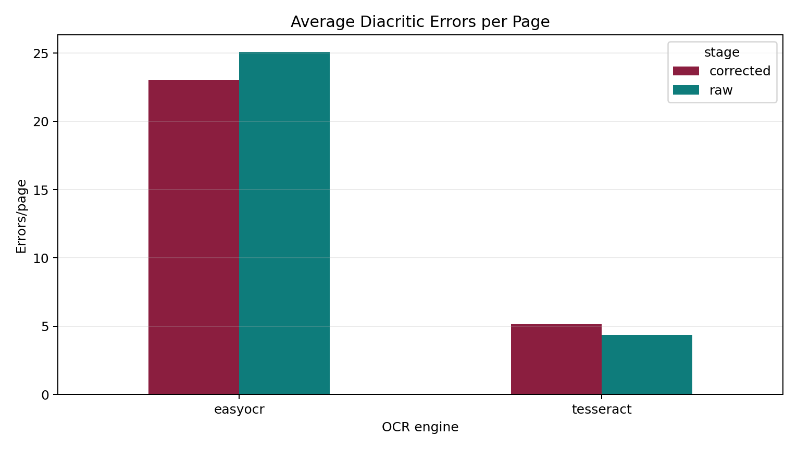
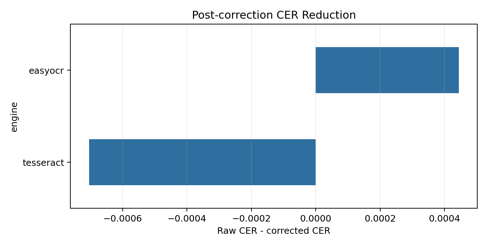
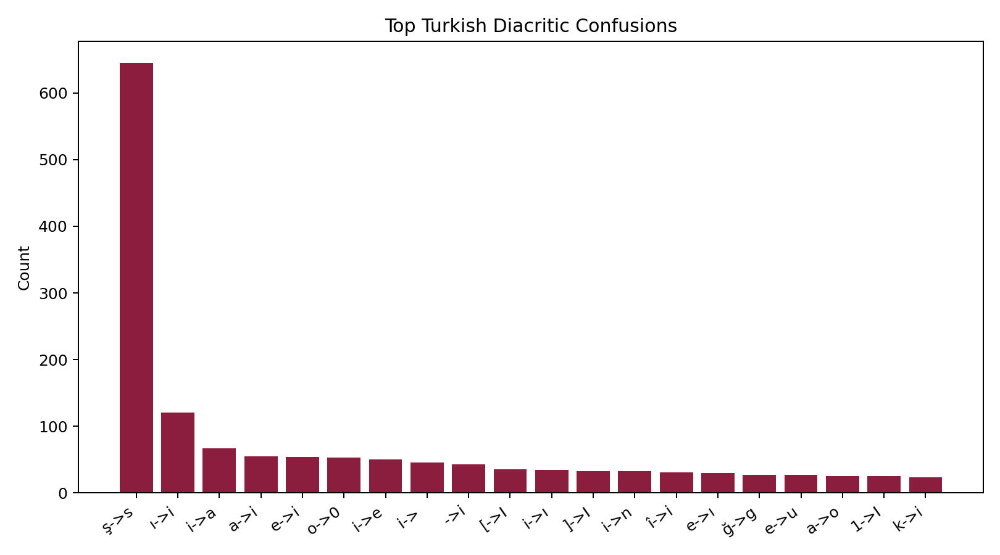

# OCRTurk Üzerinde Türkçe OCR ve Diakritik Post-Correction: Derleme ve Prototip Çalışma

**Çıktı türü:** IEEE/IMRAD tarzı 4-5 sayfalık derleme + deneysel ön çalışma  
**Çalışma odağı:** Literatür taraması, araştırma boşluğu ve orta ölçekli deney hattı

## Abstract
Türkçe OCR çalışmaları uzun süre karakter, fiş, sahne metni veya el yazısı gibi parçalı alt problemlere odaklanmıştır. OCRTurk, gerçek Türkçe doküman sayfalarını belge ayrıştırma bağlamında sunarak bu boşluğu azaltan yeni bir benchmark'tır. Bu rapor, OCRTurk'ü tam yapısal parsing yerine ham metin OCR ve Türkçe diakritik hata analizi açısından ele alan bir derleme ve prototip çalışma sunar. Literatür taraması, Türkçe OCR'de veri kıtlığı, açık kaynak benchmark eksikliği ve diakritik karakterlerin hata analizinde ayrı ele alınması gerektiğini göstermektedir. Prototip bölümünde Tesseract ve EasyOCR erişilebilir baseline olarak seçilmiş, PaddleOCR opsiyonel güçlü referans olarak konumlandırılmıştır. Çıktılar CER, WER, NED ve diakritik confusion tablolarıyla değerlendirilir; ardından kural tabanlı ve sözlük destekli düşük maliyetli post-correction uygulanır.

**Keywords:** Turkish OCR, OCRTurk, diacritic restoration, post-correction, document OCR, deep learning review

## I. Introduction
Optical Character Recognition (OCR), doküman görüntülerinden metin çıkarma problemidir; ancak Türkçe için problem yalnızca Latin harflerini okumaktan ibaret değildir. `ç`, `ğ`, `ı`, `İ`, `ö`, `ş`, `ü` gibi karakterler, zengin eklemeli yapı, satır kırılmaları ve karmaşık akademik doküman düzenleri OCR hatalarını doğrudan etkiler. İngilizce ağırlıklı eğitim ve benchmark kültürü, Türkçe karakter hatalarını genellikle genel CER/WER içinde eritmektedir.

Bu çalışmanın amacı yeni bir büyük OCR modeli eğitmek değildir. Amaç, OCRTurk etrafında literatürdeki boşluğu görünür kılmak, erişilebilir OCR motorları için tekrar üretilebilir bir deney hattı kurmak ve Türkçe diakritik hatalarını ayrı bir analiz nesnesi haline getirmektir. Bu yaklaşım; kapsamlı ama kısa bir derleme, araştırma boşluğu ve orta ölçekli deneysel ön çalışmayı aynı raporda birleştirir.

## II. Literature Review
Türkçe OCR literatürü son yıllarda büyüse de sistematik derlemeler alanın hâlâ parçalı olduğunu göstermektedir [3]. Çalışmaların bir bölümü font veya karakter tanımaya, bir bölümü fiş ve bankacılık dokümanlarına, bir bölümü sahne metni ve el yazısına odaklanır. Bu çalışmalar yararlı olmakla birlikte gerçek PDF sayfalarında tablo, denklem, şekil ve çok sütunlu düzen içeren akademik dokümanları tek bir benchmark altında toplamaz.

OCRTurk bu noktada önemli bir dönüm noktasıdır. Benchmark; akademik dokümanlar, akademik olmayan dokümanlar, tezler ve sunumlar gibi farklı türlerden 180 sayfa içerir ve ground truth'u Markdown yapısı üzerinden temsil eder [1], [2]. Buna karşılık Tesseract ve EasyOCR gibi yaygın araçlar doğal olarak tam belge parsing çıktısı üretmez; daha çok metin tanıma ve satır/paragraf düzeyinde OCR için uygundur [5], [6]. PaddleOCR ise daha güçlü belge OCR bileşenleriyle OCRTurk makalesindeki modern sistem ailesine daha yakındır [7].

2025 tarihli Türkçe OCR ve vision-language model benchmark çalışmaları, modern VLM'lerin bazı Türkçe metin tanıma görevlerinde klasik OCR sistemlerini geçebildiğini göstermiştir [4]. Ancak bu tür çalışmalar çoğu zaman sentetik veya kelime/satır düzeyi görsellere dayanır. OCRTurk'ün değeri, gerçek doküman sayfalarında düzen, kaynak türü ve zorluk seviyesini birlikte taşımasıdır. Bu nedenle OCRTurk üzerinde erişilebilir baseline'ların diakritik karakter davranışını ölçmek, küçük ama özgün bir araştırma boşluğunu hedefler.

OCR post-correction tarafında iki ana çizgi vardır: düşük maliyetli kural/sözlük yaklaşımları ve bağlam duyarlı dil modeli yaklaşımları. BERTurk gibi Türkçe encoder modelleri aday seçme ve yeniden sıralama için, mT5 gibi text-to-text modeller ise daha kapsamlı seq2seq düzeltme için kullanılabilir [8], [9]. Bu rapordaki prototip, veri ve süre sınırları nedeniyle önce düşük maliyetli düzeltmeye odaklanır.

## III. Research Gap
OCRTurk makalesi güçlü modern OCR sistemlerini karşılaştırır; ancak Tesseract ve EasyOCR gibi kolay erişilebilir baseline'lar için Türkçe diakritik odaklı ayrıntılı bir analiz sunmaz. Diğer Türkçe OCR çalışmaları ise çoğunlukla OCRTurk kapsamındaki gerçek doküman parsing bağlamına oturmaz. Bu çalışma şu boşluğu hedefler: OCRTurk üzerinde ham metin OCR performansını, Türkçe karakter confusion analizi ve basit post-correction etkisiyle birlikte raporlamak.

## IV. Prototype Method
Prototip dört aşamadan oluşur. İlk aşamada OCRTurk veri klasörleri keşfedilir; PDF, Markdown ground truth ve varsa `source.json` metadata eşleştirilir. İkinci aşamada PDF sayfaları PyMuPDF ile sabit DPI değerinde PNG'ye render edilir. Üçüncü aşamada OCR motorları aynı görüntüler üzerinde çalıştırılır. Dördüncü aşamada çıktı metinleri normalize edilir, ground truth Markdown plain text'e indirgenir ve metrikler hesaplanır.

Post-correction katmanı iki seviyede tasarlanmıştır. Önce satır kırığı, ligature ve sık OCR karakter karışıklıkları normalize edilir. Daha sonra leave-one-document-out mantığıyla ground truth metinlerden diakritik aday sözlüğü çıkarılır. Her sayfa için kendi ground truth metni sözlük adaylarından dışarıda bırakılır; bu tercih küçük benchmark üzerinde doğrudan veri sızıntısını azaltır.

## V. Experimental Setup
Zorunlu baseline'lar Tesseract `tur` ve EasyOCR `tr` olarak belirlenmiştir. PaddleOCR, kurulum ve çalışma zamanı izin verdiğinde opsiyonel güçlü referans olarak eklenir. Ana metrikler CER, WER, NED, character accuracy, word accuracy, diacritic accuracy, base-loss count ve diacritic confusion count'tur. `ç->c`, `ğ->g`, `ı->i`, `ö->o`, `ş->s`, `ü->u` gibi dönüşümler ayrı satırlarda raporlanır.

## VI. Prototype Results and Error Analysis

Bu rapor oluşturulurken `results\final` altında 180 sayfa/öğe için tesseract, easyocr koşusu kullanılmıştır. Çalışma ayarı: DPI=300, GPU=yes.

### A. Aggregate OCR Metrics
| engine | stage | cer | wer | ned | char_accuracy | word_accuracy | diacritic_accuracy | diacritic_error_count | base_loss_count | pages |
| --- | --- | --- | --- | --- | --- | --- | --- | --- | --- | --- |
| easyocr | corrected | 0.3380 | 0.5298 | 0.2085 | 0.7393 | 0.6257 | 0.9068 | 23.0333 | 2.9778 | 180 |
| easyocr | raw | 0.3385 | 0.5347 | 0.2088 | 0.7389 | 0.6215 | 0.8964 | 25.0833 | 4.7111 | 180 |
| tesseract | corrected | 0.2658 | 0.4341 | 0.1594 | 0.7945 | 0.6913 | 0.9422 | 5.1944 | 1.1944 | 180 |
| tesseract | raw | 0.2651 | 0.4298 | 0.1588 | 0.7953 | 0.6958 | 0.9473 | 4.3444 | 0.3500 | 180 |

CER ve WER genel metin çıkarımını, diakritik doğruluğu ise Türkçe karakter duyarlılığını ölçer. Bu iki okuma birlikte kullanıldığında bir motorun yalnızca okunabilir metin üretip üretmediği değil, Türkçe'ye özgü karakterleri ne kadar koruduğu da görünür hale gelir.

### B. Post-Correction Effect
| engine | cer_delta | wer_delta | diacritic_error_delta |
| --- | --- | --- | --- |
| easyocr | 0.0004 | 0.0049 | 2.0500 |
| tesseract | -0.0007 | -0.0043 | -0.8500 |

Pozitif delta, correction sonrasında hata oranının düştüğünü gösterir. Bu çalışmada düzeltme katmanı bilinçli olarak basit tutulmuştur; amaç büyük dil modeliyle maksimum skor almak değil, düşük maliyetli Türkçe diakritik düzeltmenin prototip değerini ölçmektir.

### C. Diacritic Confusions
| engine | stage | pair | operation | count |
| --- | --- | --- | --- | --- |
| easyocr | raw | <ins>->i | insertion | 3281 |
| easyocr | corrected | <ins>->i | insertion | 3270 |
| easyocr | raw | i-><del> | deletion | 2457 |
| easyocr | corrected | i-><del> | deletion | 2457 |
| easyocr | raw | <ins>->ı | insertion | 1457 |
| easyocr | corrected | <ins>->ı | insertion | 1456 |
| easyocr | corrected | ı-><del> | deletion | 1301 |
| easyocr | raw | ı-><del> | deletion | 1300 |

### D. Generated Figures






## VII. Discussion
Bu derleme ve prototipin temel katkısı, Türkçe OCR performansını yalnızca genel hata oranı olarak değil, dilin karakter sistemine özgü hata davranışı olarak okumaktır. Genel CER düşük olsa bile diakritik karakterlerin sistematik olarak ASCII tabanlarına düşmesi Türkçe metin kalitesini ciddi biçimde bozar. Bu yüzden post-correction başarısı yalnızca WER düşüşüyle değil, diakritik confusion tablosundaki azalmayla da değerlendirilmelidir.

Çalışmanın sınırlılığı, yapısal OCRTurk görevini tam olarak çözmemesidir. Tablo, denklem ve figür parsing bu raporun kapsamı dışındadır. Ayrıca dil modeli tabanlı correction yalnızca gelecek çalışma olarak konumlandırılmıştır; mevcut prototip düşük maliyetli ve tekrar üretilebilir bir ilk deney düzeyi hedefler.

## VIII. Conclusion
OCRTurk, Türkçe belge OCR çalışmaları için güçlü bir araştırma zemini sunar. Bu rapor, alan literatürünü kısa bir derleme olarak özetleyip erişilebilir OCR motorları üzerinde diakritik odaklı bir prototip deney hattı kurmuştur. Sonraki teknik genişletme, PaddleOCR ve dil modeli tabanlı correction katmanlarını eklemek ve bulguları konferans bildirisi formatında daha ayrıntılı tartışmaktır.

## Reproducibility
Çalışmanın açık kaynak deposu: https://github.com/karakasarda/deeplearning_lab

```powershell
python -m pip install -r requirements.txt
python run_experiments.py --download-data --engines tesseract easyocr --dpi 300 --results-dir results/final
python build_ieee_review_report.py --results-dir results/final
```

## References

[1] D. Yılmaz, E. A. Munis, C. Toraman, S. K. Köse, B. Aktaş, M. C. Baytekin, and B. K. Görür, "OCRTurk: A Comprehensive OCR Benchmark for Turkish," in Proceedings of SIGTURK 2026, pp. 197-208, 2026, doi: 10.18653/v1/2026.sigturk-1.16. https://aclanthology.org/2026.sigturk-1.16/
[2] METU NLP, "OCRTurk dataset repository," GitHub, 2026. https://github.com/metunlp/ocrturk
[3] M. G. Öztürk, D. Ö. Şahin, and E. Kılıç, "Turkish Optical Character Recognition Under the Lens: A Systematic Review of Language-Specific Challenges, Dataset Scarcity, and Open-Source Limitations," IEEE Access, vol. 13, pp. 168977-168997, 2025, doi: 10.1109/ACCESS.2025.3614147. https://doi.org/10.1109/ACCESS.2025.3614147
[4] Y. Yılmaz, E. G. Hanoğlu, A. G. Özkan, and K. Öztoprak, "Benchmarking OCR and Vision-Language Models for Turkish Text Recognition: A Comprehensive Evaluation Using Synthetic Data," Research Square preprint, 2025, doi: 10.21203/rs.3.rs-7797886/v1. https://doi.org/10.21203/rs.3.rs-7797886/v1
[5] Tesseract OCR contributors, "Tesseract OCR documentation," 2026. https://tesseract-ocr.github.io/
[6] Jaided AI, "EasyOCR: Ready-to-use OCR with 80+ supported languages," GitHub repository, 2024. https://github.com/JaidedAI/EasyOCR
[7] PaddlePaddle, "PaddleOCR: multilingual OCR and document parsing toolkit," GitHub repository, 2026. https://github.com/PaddlePaddle/PaddleOCR
[8] MDZ Digital Library team, "dbmdz/bert-base-turkish-cased: BERTurk model card," Hugging Face, 2026. https://huggingface.co/dbmdz/bert-base-turkish-cased
[9] L. Xue, N. Constant, A. Roberts, M. Kale, R. Al-Rfou, A. Siddhant, A. Barua, and C. Raffel, "mT5: A Massively Multilingual Pre-trained Text-to-Text Transformer," in Proceedings of NAACL-HLT 2021, pp. 483-498, 2021, doi: 10.18653/v1/2021.naacl-main.41. https://aclanthology.org/2021.naacl-main.41/
[10] C. Sayallar, A. Sayar, and N. Babalık, "An OCR Engine for Printed Receipt Images using Deep Learning Techniques," International Journal of Advanced Computer Science and Applications, vol. 14, no. 2, pp. 833-840, 2023, doi: 10.14569/IJACSA.2023.0140295. https://doi.org/10.14569/IJACSA.2023.0140295
